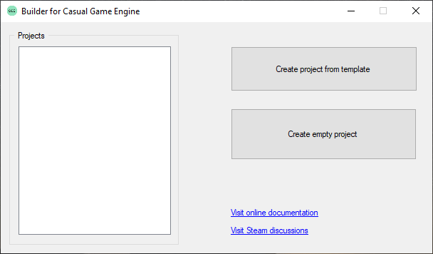
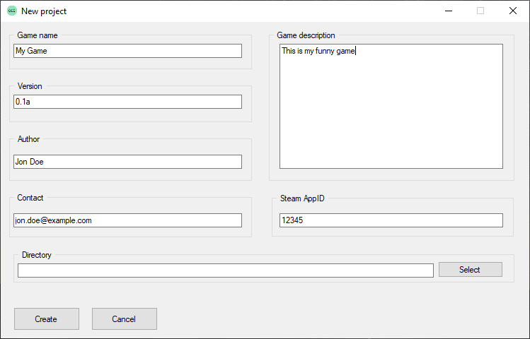
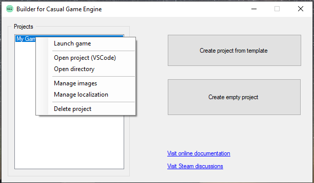

## Create a game

Creating the base for your game is done with a few steps.

Therefore open the Casual Game Engine builder. You will now have the following UI available: 

You can either create a game by template or an empty project. It is recommended to create a game from
template, because it will provide you with an example game which you can build upon, modify or refer to
if you want to get to know how to implement something or how to use the API. 

So, click on "Create project from template" and a new window will popup:\

Fill out the form. If you don't have a Steam AppID yet then just enter -1 as value. 
Select a path where your project shall be stored. It will create a folder using your game name
as folder name and copy the project files into that folder.

Click on "Create" in order to create the new project.

You will now see your project in the project list on the left. If you right-click on your project,
you will be provided with a set of actions:

Choose an action you desire. You can also comfortably launch your game. Feel free to try out your recently
created game project, it will already work.

[Next chapter](imagesetup.html) 
[Back](index.html)
