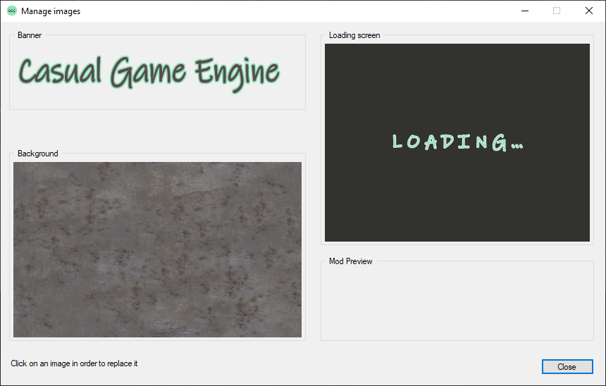

## Set up game images

An important operation is to change your main game image assets. Therefore right-click on your project
and select "Manage images".  
The following window will open: 

The usage of the assets are:
1. Banner: Shown in the game main menu (768x150)
2. Background: Shown as background in the game main menu when no game is started
3. Loading screen: This is the loading image which is shown when loading a game
4. Mod Preview: In case your game is actually a mod, you will need to set this preview image (195x90)

Click on an asset and a file chooser will open where you can select your new asset. It will then replace the old asset.

[Back](index.html)
