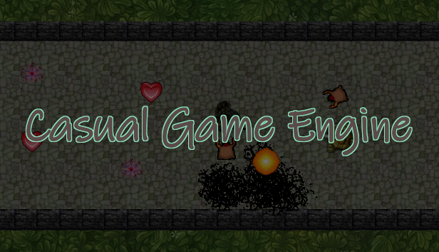

## Welcome to the official documentation of Casual Game Engine

Casual Game Engine is a 2D singleplayer top down-shooter engine which lets you create such kind of
games using AngelScript as scripting language. AngelScript is an easy-to-use scripting language
that has a wide popularity in the game development universe.

This documentation helps you with creating your own games using the engine.

### Table of contents
1. [Installation](installation.html)
2. [Create a game](gamecreation.html)
3. [Setup images](imagesetup.html)
4. [Implement your game](implementing.html)
5. [Manage localization](localization.html)
6. [API reference](apireference.html)

If you need help using the engine, feel free to create a topic at the [Steam discussions](https://steamcommunity.com/app/1725730/discussions/). 
If you need help with the basis of AngelScript, have a look at the [AngelScript documentation](https://www.angelcode.com/angelscript/sdk/docs/manual/index.html).