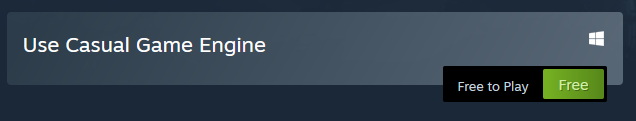

## Installation

The installation of Casual Game Engine works via Steam. In Steam go to the store page to [Casual Game Engine](https://store.steampowered.com/app/1725730/Casual_Game_Engine/). It is a free download. 

Steam will install the product for you and add it to your library. After the download has finished, you can launch the tool via your Steam library. This will actually launch the CGE builder which is used to create your game and manage
some of the game assets.

Since you have to program your game behavior and game entities via AngelScript, it is highly suggested to install a code editor that supports
syntax highlighting for AngelScript. I recommend using VS Code by Microsoft for that purpose. After installing VS Code you can browse the extensions
for AngelScript syntax highlighting and install a suitable extension. VS Code will then recognize .as files and link them to AngelScript syntax
highlighting.

After installing everything you can launch CGE builder and start creating your game.

[Next chapter](gamecreation.html)\
[Back](index.html)