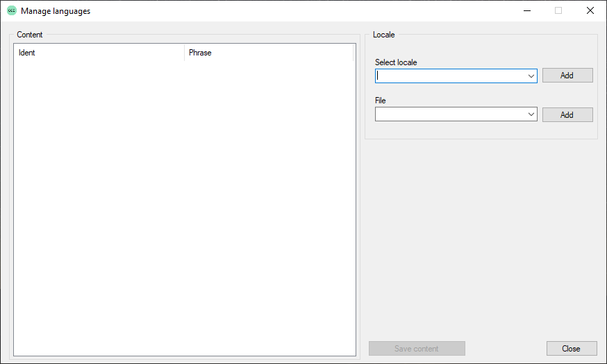
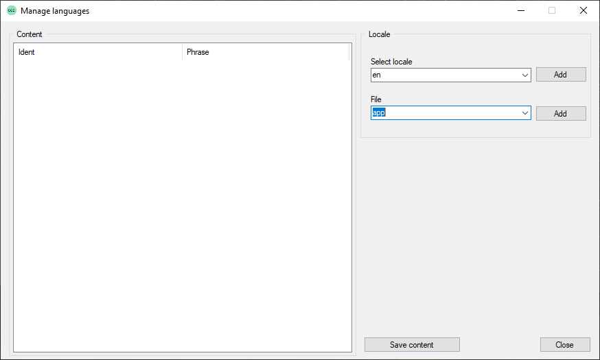

## Localization

In order to manage localizations, right-click on your project and select "Manage localization".<br/>
The following window will show:<br/>


In order to manage the phrases of a language you first need to create a locale folder for the related language.
Click the add button of locale to create a new language locale folder. You should stick with short names, e.g.
"en" for "english". 
Select you newly created locale and create a new language content file. Actually for each locale you can have
multiple language files which is good if you want to group your phrases to different topics. As a common rule,
we use "app" as name for all generic phrases. Now, create the new content file.


You will now see that the "Save content" button is activated. The button is used to store your content to the file.
Now first we need to create phrases. Right-click into the list and select "Add...". Then specify the identifier
of the phrase and then its content. It will then be shown into the list.

You can then also edit the phrase or delete it. After you are done with managing the content, don't forget to save
the content or else it will be lost!

On a programmatical level you can then query a phrase using the following API function:
```angelscript
string Lang_QueryPhrase(const string &in szIdent, const string &in szDefault = "") //Or '_' as a conventient shortcut
```

When querying a phrase you need to specify the content file of the locale and also the phrase ident. 
We have created your 'test' phrase in the 'app' content file, so a call would be as follows:
```angelscript
string phrase = Lang_QueryPhrase("app.test", "This is the fallback phrase");
//Or using the shortcut
string phrase = _("app.test", "This is the fallback phrase");
```

The result will be the phrase content, or if not found, the fallback content.
Note that the locale is automatically managed by the game engine. Users can change languages in the game settings.

[Next chapter](apireference.html)<br/>
[Back](index.html)
